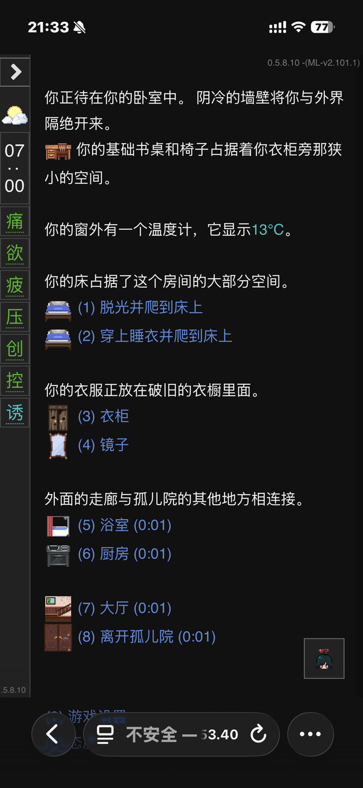
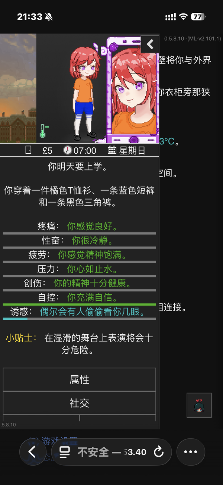
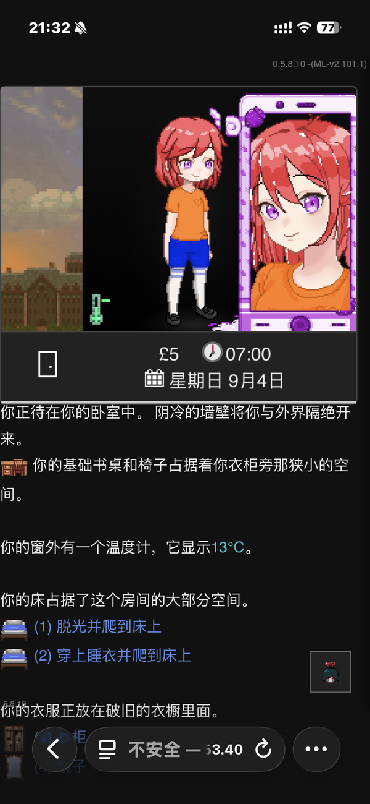
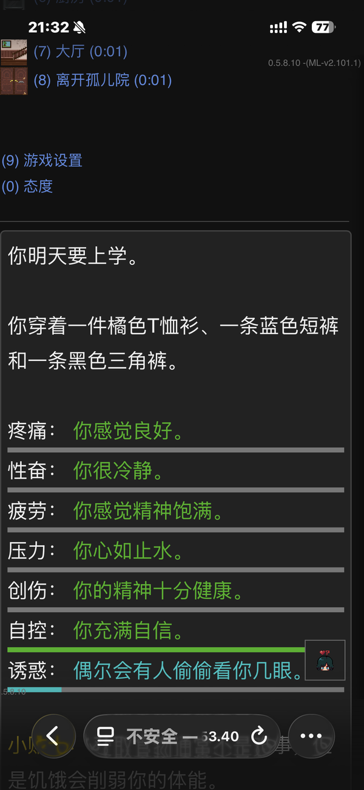
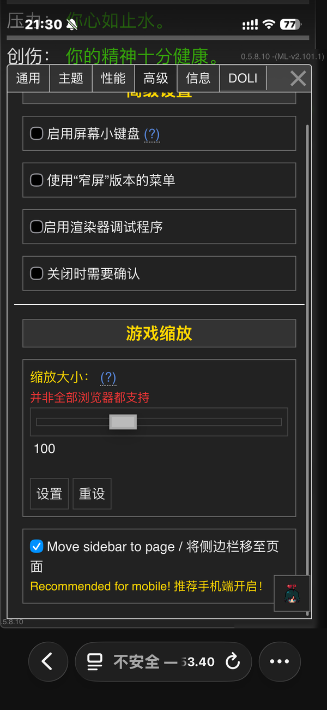

# SidebarToBottom

**DoL ModLoader mod — 将侧边栏内容移至游戏页面，手机端体验大幅提升**

*A Degrees of Lewdity ModLoader mod that moves sidebar content into the main passage for a much better mobile experience.*

---

## 中文说明

### 痛点

DoL 手机端的侧边栏默认收起，每次查看角色状态都要点开→看→关闭，打断游戏节奏。

### 解决方案

SidebarToBottom 将侧边栏拆分后嵌入游戏页面：

- **页面顶部** — 天气 + 角色立绘 + 金钱/时间信息
- **页面底部** — 属性条 + 功能按钮

两个区域自动等比缩放适配屏幕宽度，无需手动缩放即可看清全部信息。

### 截图对比

**开启前** — 侧边栏收起，看不到状态；展开后遮挡游戏内容：

**开启后** — 立绘和时间在顶部，属性条在底部，一目了然：

**设置位置** — Options → General → Sidebar 区块最下方：

### 安装

1. 确保你的 DoL 已安装 [ModLoader](https://github.com/AceDev98/ModLoader) v2.x
2. 下载 [SidebarToBottom.mod.zip](https://github.com/midimao/dol-sidebar-to-bottom/releases/latest)
3. 在 ModLoader 中加载该 zip 文件
4. 进入游戏 → Options → General → Sidebar 区块 → 勾选 **"Move sidebar to page / 将侧边栏移至页面"**

### 兼容性

- DoL 0.5.8.x + ModLoader v2.x
- 中文 / 英文界面均可
- 推荐手机端使用，PC 端也能用

### 已知限制

- 侧边栏内容是物理移动（非克隆），开启后原侧边栏区域为空，这是正常行为
- 如果使用其他修改侧边栏的 mod，可能存在冲突

---

## English

### The Problem

On mobile, DoL's sidebar is collapsed by default. Checking your character's status means tap open → read → close, every single time.

### The Solution

SidebarToBottom splits the sidebar and embeds it directly into the passage:

- **Top of page** — skybox + character portrait + money/time
- **Bottom of page** — stat bars + action buttons

Both sections auto-scale to fit your screen width. No pinching or zooming required.

### Screenshots

**Before** — sidebar collapsed (no status visible) vs. expanded (covers game content):

**After** — portrait & time at top, stat bars at bottom, all visible at a glance:

**Settings** — Options → General → Sidebar (last item):

### Installation

1. Make sure your DoL has [ModLoader](https://github.com/AceDev98/ModLoader) v2.x installed
2. Download [SidebarToBottom.mod.zip](https://github.com/midimao/dol-sidebar-to-bottom/releases/latest) from Releases
3. Load the zip in ModLoader
4. In-game: Options → General → Sidebar → check **"Move sidebar to page"**

### Compatibility

- DoL 0.5.8.x + ModLoader v2.x
- Works with both Chinese and English UI
- Designed for mobile, works on desktop too

### Known Limitations

- Sidebar content is physically moved (not cloned) — the original sidebar will be empty when enabled; this is expected
- May conflict with other mods that modify the sidebar

---

## Technical Details

- Pure vanilla JS — no build step, no dependencies
- CSS overrides for layout repositioning
- SugarCube `:passageend` event hook for DOM manipulation
- `MutationObserver` to inject settings checkbox (language-agnostic, no twee patch needed)
- Settings persist with save data via `V.options.sidebarToBottom`

## Changelog

### v3.0.0 (2026-03-31)
- Final release combining all improvements
- Top section: skybox + portrait + temperature + money/time
- Bottom section: stat meters + buttons
- Auto-scaling for both sections
- Stat meter color bars z-index fix
- History navigation arrows repositioned to top-right
- Clean settings injection via MutationObserver

### v2.x (Development)
- v2.5: Auto-scaling to passage width
- v2.3: Stat meter z-index fix (colored bars invisible issue)
- v2.0: Split layout — portrait top, stats bottom

### v1.x (Development)
- v1.2: Switched from twee patch to pure JS settings injection
- v1.0: Initial concept — entire sidebar moved to bottom

## License

[MIT](LICENSE)
